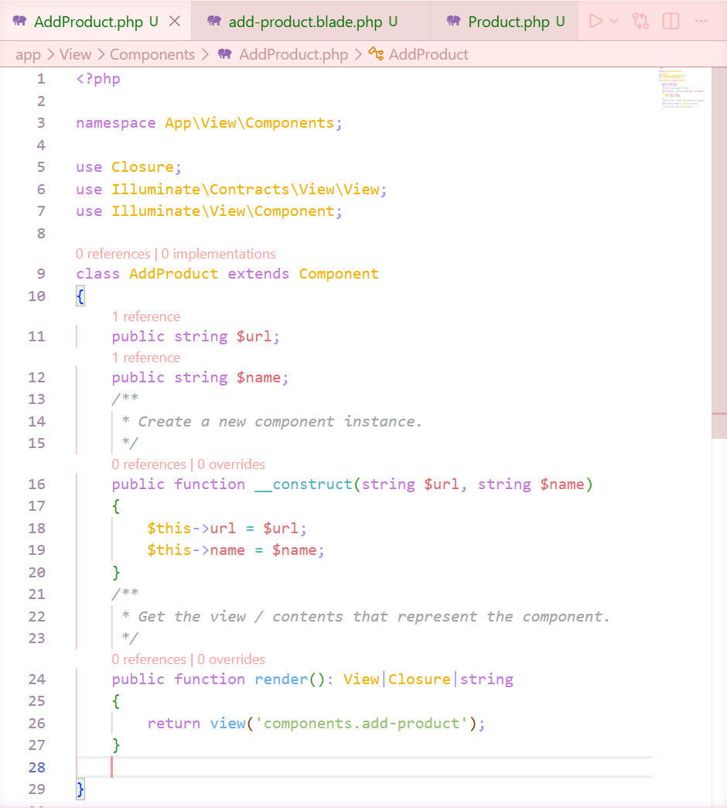
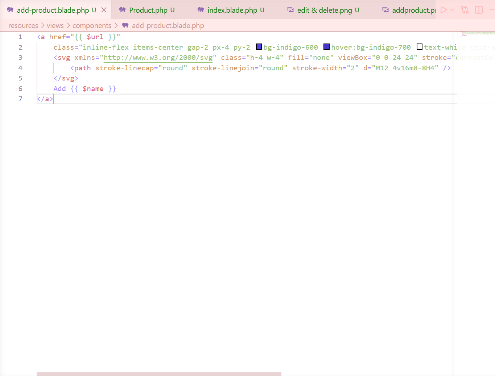
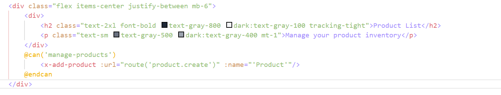
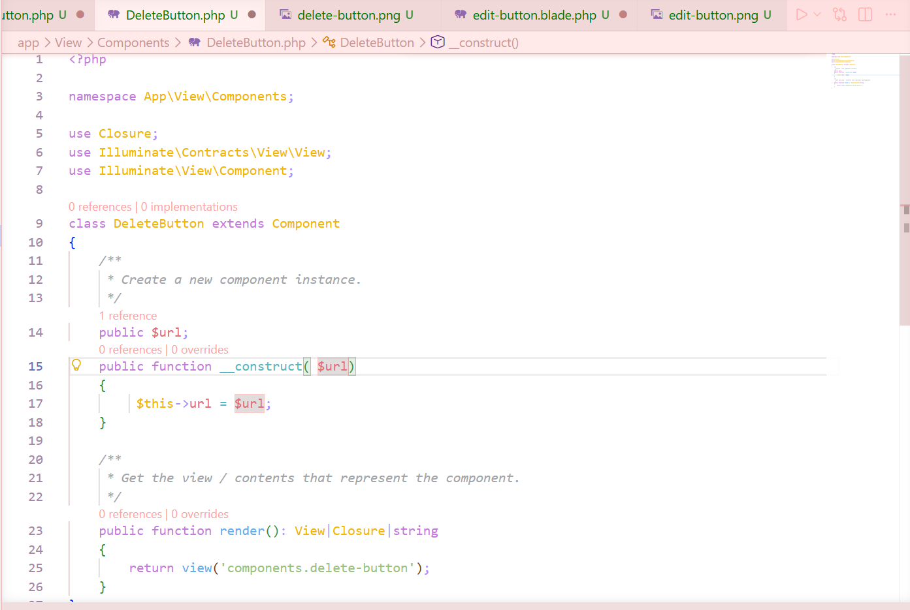
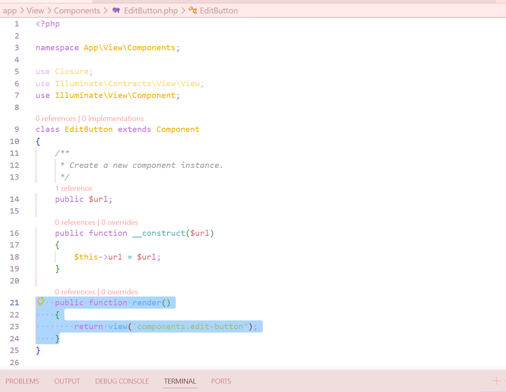
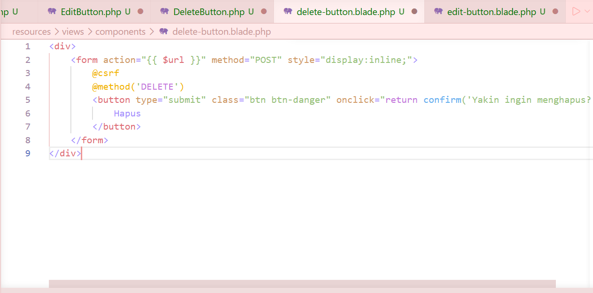
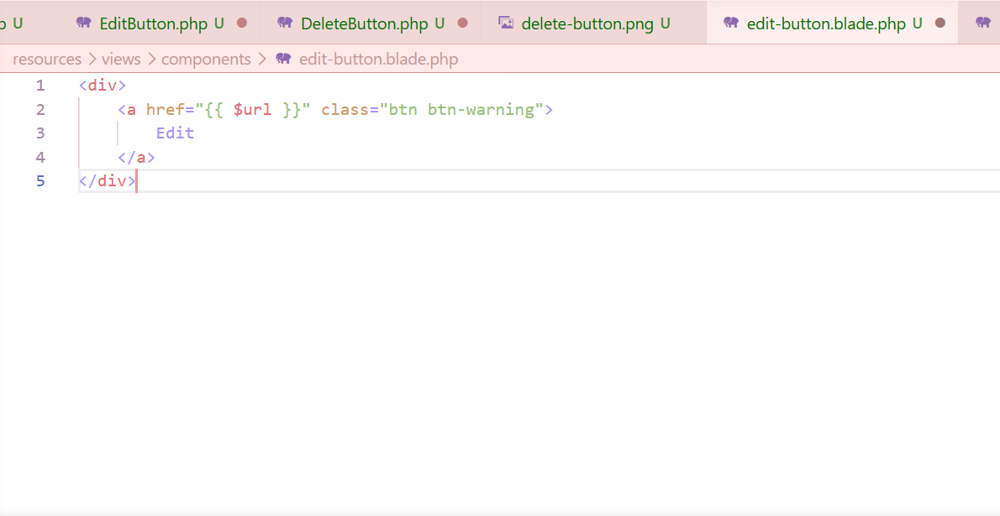
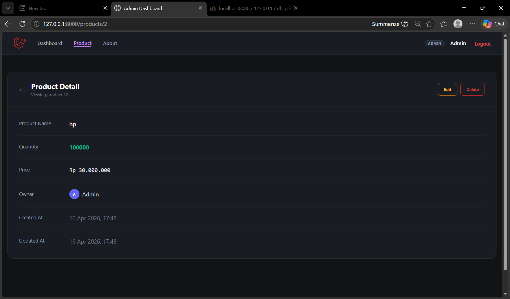

## 📸 Dokumentasi Hasil Tugas

Berikut adalah bukti screenshot dari implementasi component:

### 1. Pembuatan component add product
Tampilan kode pada folder `app/View/Components` dan `resources/views/components`.

### 2. Pembuatan component edit dan delete
Tampilan kode pada folder `app/View/Components` dan `resources/views/components`.

### 3. Hasil Akhir di Browser
Tampilan tombol Edit dan Delete yang sudah berhasil di-render di halaman index.

